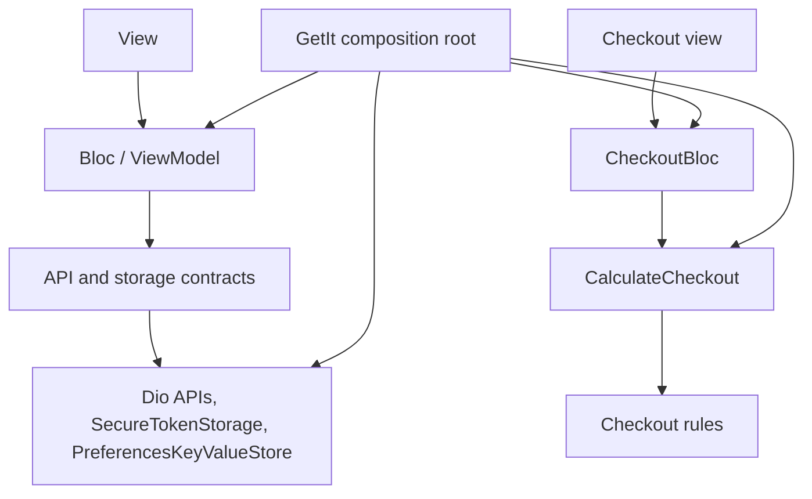

# mini_ecommerce_app_prompt

A Flutter mini shop. A shopper can browse products, open a product, keep a local cart, sign in, check out, and view a profile. Remote calls go to `https://api.example.com` through Dio. Checkout totals are calculated in the app before an order is placed.

## Getting Started

This project is a Flutter application.

A few resources to get you started if this is your first Flutter project:

- [Learn Flutter](https://docs.flutter.dev/get-started/learn-flutter)
- [Write your first Flutter app](https://docs.flutter.dev/get-started/codelab)
- [Flutter learning resources](https://docs.flutter.dev/reference/learning-resources)

For help getting started with Flutter development, view the
[online documentation](https://docs.flutter.dev/), which offers tutorials,
samples, guidance on mobile development, and a full API reference.

From the project root:

```bash
flutter pub get
flutter test
flutter run
```

## Architecture

The project follows MVVM + Repository with a feature-first structure under `lib/features`.

Each screen is a View. It sends user actions to a Bloc and renders the state that Bloc emits. Bloc acts as the ViewModel: it owns presentation state and calls data or domain types. It does not build widgets.

A repository is used where a feature coordinates more than one data concern. Auth pairs the login API with token storage. Cart owns local JSON, owner keys, and the guest merge. Other features call an API contract directly.

## Architecture Principles

- **Separation of concerns.** Views render state. Blocs handle actions and UI state. Models hold data. Network and storage stay behind contracts in `lib/core` and each feature's `data` folder.
- **Dependency inversion.** Feature code depends on contracts such as `AuthApi`, `ProductsApi`, and `TokenStorage`. `lib/core/di/injection.dart` supplies the Dio, secure-storage, and preferences implementations.
- **Feature-first organization.** Auth, products, cart, checkout, and profile each keep their own view, viewmodel, data, and model files.
- **Unidirectional data flow.** The view dispatches an event. The Bloc reads data, runs any rules, and emits the next state. The view rebuilds from that state.
- **Avoiding unnecessary abstractions.** A repository or use case is added only when it has a job that a direct API call cannot cover.
- **Every abstraction must solve a real problem.** Checkout has a domain layer because pricing rules are real. A pass-through wrapper around one HTTP call is left out.

## Architecture Overview

GetIt is the composition root. It creates the API and storage implementations, the two repositories, `CalculateCheckout`, and the Blocs. Views receive those Blocs through `BlocProvider`.



Auth and cart reach `TokenStorage` and `KeyValueStore` through `AuthRepository` and `CartRepository`. Products, profile, coupon validation, and order placement use their API contracts directly.

## Feature Architecture

| Feature | Role | Main types |
| --- | --- | --- |
| Auth | Login and session | `LoginBloc`, `SessionBloc`, `AuthRepository`, `AuthApi` |
| Products | Catalog | `ProductsBloc`, `ProductsApi` |
| Product Details | One product | `ProductDetailsBloc`, same `ProductsApi` |
| Cart | Local cart for the current owner | `CartBloc`, `CartRepository` |
| Checkout | Quote, place order, confirmation | `CheckoutBloc`, `CalculateCheckout`, `CouponApi`, `CheckoutApi` |
| Profile | Signed-in user | `ProfileBloc`, `ProfileApi` |

Product details lives in the products feature (`product_details_page.dart` and `product_details_bloc.dart`). It is a separate screen and Bloc, and it loads one product through `ProductsApi`.

Typical folders inside a feature are `view`, `viewmodel`, `data`, and `model`. Splash is a startup screen at `lib/features/splash` while the session is restored. It has no Bloc of its own.

The domain layer exists only in Checkout (`lib/features/checkout/domain`) because that feature contains real business rules: money, coupons, membership, VAT, shipping, and the minimum order. Other features have no domain folder.

## Dependency Injection

`lib/core/di/injection.dart` is the composition root. `configureDependencies()` builds the object graph once at startup, and `main.dart` calls it before `runApp`.

GetIt registers the contracts feature code is allowed to see:

- `AuthApi` — `DioAuthApi`
- `ProductsApi` — `DioProductsApi`
- `CouponApi` — `DioCouponApi`
- `CheckoutApi` — `DioCheckoutApi`
- `ProfileApi` — `DioProfileApi`
- `TokenStorage` — `SecureTokenStorage`
- `KeyValueStore` — `PreferencesKeyValueStore`

`AuthRepository`, `CartRepository`, `CalculateCheckout`, `CheckoutPolicy.standard`, `SessionBloc`, `CartBloc`, and `GoRouter` are registered there as well. `LoginBloc`, `ProductsBloc`, `ProductDetailsBloc`, `CheckoutBloc`, and `ProfileBloc` are factories so each visit gets a fresh instance.

Raw `Dio`, `SharedPreferences`, and `FlutterSecureStorage` are created inside the composition root and are not registered. Feature code cannot ask GetIt for them. It receives the contract, and the Dio client in `lib/core/network/dio_client.dart` stays behind the `Dio*Api` classes.

## Repository Decisions

`AuthRepository` exists because login is two steps that must stay together: `AuthApi.login` returns a session, and `TokenStorage` must store that token. The same type reads and clears the saved token for session restore and sign-out.

`CartRepository` exists because the cart is local state with its own rules. It maps the current owner to `cart_guest` or `cart_user_{userId}`, encodes the cart as JSON, drops a cart that cannot be decoded, merges a guest cart into a user cart on sign-in, and publishes updates when the stored cart changes.

Products, product details, profile, coupon validation, and placing an order are single remote calls. Their Blocs depend on `ProductsApi`, `ProfileApi`, `CouponApi`, or `CheckoutApi`. A repository around any of those calls would only forward one method, so none was added.

## Checkout

`CalculateCheckout` builds a `CheckoutQuote` in this order:

1. **Merchandise total.** Sum of each line's price in minor units multiplied by quantity.
2. **Minimum order check.** The merchandise total is compared with `CheckoutPolicy.minimumOrder`. `canPlaceOrder` follows that check. A later coupon does not change it.
3. **Coupon.** A percent coupon or a fixed coupon is applied to the merchandise total. A missing or non-positive coupon discounts nothing. The discount is clamped so it cannot exceed the merchandise total.
4. **Membership discount.** The signed-in user's `membershipBasisPoints` is applied to the post-coupon amount.
5. **VAT.** `CheckoutPolicy.vatBasisPoints` is applied to the taxable amount left after coupon and membership.
6. **Shipping.** The quote uses `CheckoutPolicy.flatShipping` when the free-shipping rule does not apply. A negative flat amount is treated as zero.
7. **Free shipping threshold.** Shipping is zero when the merchandise total is greater than or equal to `CheckoutPolicy.freeShippingThreshold`.

Free shipping uses the pre-discount merchandise total. A coupon that lowers the goods total does not bring shipping back.

The standard policy in `CheckoutPolicy.standard` is a 5000 minor-unit minimum, 1400 basis points of VAT (14%), 1500 minor units of flat shipping, and a 20000 minor-unit free-shipping threshold.

Money uses integer minor units instead of `double`. Percentages use basis points, and `percentOfMinor` rounds half up.

```text
$19.99 → 1999
```

## Checkout Flow

```text
Checkout Page
→ CheckoutBloc
→ CalculateCheckout
→ Checkout Quote
→ Checkout API
→ Clear correct user's cart
→ Order Confirmation
```

`CheckoutPage` dispatches `CheckoutRequested`. `CheckoutBloc` reads the current owner's cart, asks `CouponApi` to validate a saved code when one is present, and calls `CalculateCheckout` with the lines, policy, coupon, and membership rate. An invalid coupon is left off the quote, and the quote is still shown in `CheckoutReady`.

On submit, `CheckoutApi.placeOrder` sends the lines and applied coupon code. After a successful response, the Bloc writes an empty cart for `ownerId` only, then emits `CheckoutSuccess`. The page opens `/checkout/confirmation` with the placed order.

`CalculateCheckout` is pure Dart. It depends only on checkout domain types. It has no Flutter, Dio, or storage dependency, so the pricing rules can run in a plain Dart test.

## Cart Ownership

The cart is stored per owner:

- `cart_guest` — no signed-in user id
- `cart_user_{userId}` — the cart for that user

A guest browses and edits `cart_guest`. When that guest signs in, `CartRepository.mergeGuestIntoUser` adds guest quantities into `cart_user_{userId}`, keeps the user coupon when one is already stored, and then clears `cart_guest`.

After a successful order, `CheckoutBloc` clears only the current owner's cart by writing an empty cart with that `userId`. Another user's `cart_user_{userId}` entry is left as it is.

## Navigation & Authentication

Routes are declared in `lib/core/router/app_router.dart` with go_router.

- Guests can browse Products (`/products`), Product Details (`/products/:id`), and Cart (`/cart`).
- Checkout (`/checkout`), order confirmation (`/checkout/confirmation`), and Profile (`/profile`) require authentication.
- Authentication redirects are handled by go_router. A signed-out visit to a protected route goes to `/login`, and the previous location is kept in the `from` query when it is a safe in-app path. A signed-in visit to `/login` returns to that path, or to `/products`.
- While `SessionBloc` is loading, go_router sends the app to `/`, which shows the splash page. After the session resolves, `/` continues to `/products`.

401 handling clears the session without coupling Dio directly to `SessionBloc`. `AuthInterceptor` reads the token, attaches `Authorization: Bearer`, and on an unauthorized response other than login it clears `TokenStorage` and calls `UnauthorizedNotifier`. `SessionBloc` listens to that notifier and emits `SessionUnauthenticated`. The interceptor does not reference the Bloc.

## UI States

Screens render the state their Bloc emits, using `LoadingView`, `ErrorView`, and `EmptyView` where that state exists.

- **Products:** loading, error, empty, ready.
- **Product details:** loading, error, not available, ready.
- **Cart:** loading, error, empty, ready.
- **Checkout:** loading, empty cart, error, ready quote, submitting, submit error, success.
- **Profile:** loading, error, ready.
- **Login:** idle, submitting, error, success.
- **Order confirmation:** the placed order, or an error when the confirmation extra is missing.

## Testing

`CalculateCheckout` is tested with pure Dart tests in `test/features/checkout/calculate_checkout_test.dart`. `CheckoutBloc` is tested with fakes in `test/features/checkout/checkout_bloc_test.dart`.

Those tests cover checkout calculations, coupons, membership, VAT, shipping, rounding, minimum order, cart clearing, and edge cases. Further tests cover `AuthRepository`, `CartRepository`, and `ProductsBloc`.

The tests pass.

## Architecture Trade-offs

| Decision | Chosen | Why | Trade-off |
| --- | --- | --- | --- |
| MVVM + Repository | Views, Blocs, and repositories for auth and cart | Screens stay free of HTTP and pricing rules, and auth and cart have real coordination to hide | Repository use is uneven, because most features call an API contract directly |
| Bloc as ViewModel | `flutter_bloc` | Each screen has an explicit event and a single state for the view to render | Every interaction adds an event and a state type |
| Use case only for Checkout | `CalculateCheckout` | Pricing rules are pure and need their own tests | Checkout is structured differently from catalog and profile |
| GetIt | Manual registration in `injection.dart` | One place wires contracts to implementations | The graph is a service locator, and new types must be registered by hand |
| Dio | One client behind `Dio*Api` classes | Timeouts, JSON, and the auth interceptor live in one client | Call sites depend on the mapped `AppFailure` behavior of that client |
| Secure token storage | `FlutterSecureStorage` behind `TokenStorage` | The auth token is kept out of the cart preferences | The app depends on platform secure storage |
| SharedPreferences for cart | `PreferencesKeyValueStore` | The cart is a small JSON document, addressed by owner key | The cart is on one device and is cleared only for the owner key that is written |
| go_router | `buildRouter` plus a session refresh stream | Guest and signed-in access is decided in one redirect | Redirect behavior is concentrated in the router |
| Feature-first organization | `lib/features/<feature>` | Each feature keeps its view, Bloc, data, and model together | Product details shares the products feature, and session and cart Blocs are app-wide singletons |

## Intentionally Not Abstracted

Products, product details, profile, coupon lookup, and order placement call their API contracts from the Bloc. They do not have a repository or a use case.

Those features currently perform one remote read or write and hold no extra business rule. An extra layer would not change the data, the error mapping, or the tests. Checkout keeps `CalculateCheckout` because the quote rules are that extra problem. Auth and cart keep repositories because token persistence and owner-specific cart storage are that extra problem.
