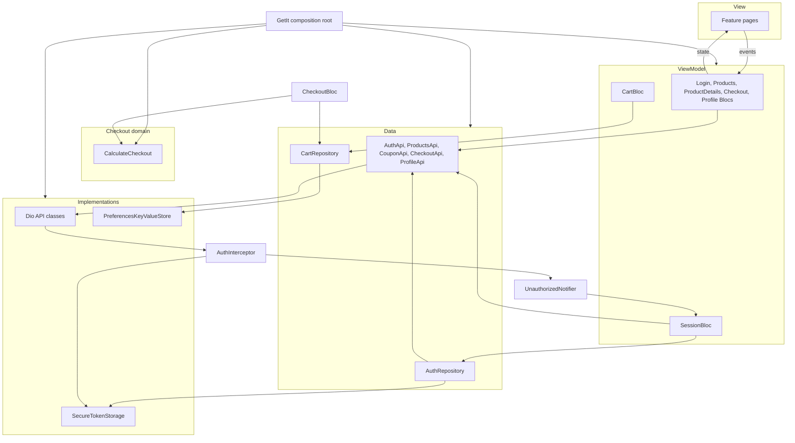

# Mini shop

A Flutter shopper can browse products, open a product, keep a local cart, sign in, check out, and view a profile. Remote calls go to `https://api.example.com` through Dio. Checkout totals are calculated in the app before an order is placed.

```bash
flutter pub get
flutter test
flutter run
```

## Architecture

The project uses MVVM with a repository only where one type must coordinate more than one data concern. Code is organized by feature under `lib/features`.

A screen is a View. It sends user actions to a Bloc and renders the state that Bloc emits. The Bloc is the ViewModel: it owns presentation state and calls data or domain types. It does not build widgets.

```text
lib/
├── main.dart
├── app.dart
├── core/
│   ├── di/            GetIt composition root
│   ├── router/        go_router and auth redirects
│   ├── error/         AppFailure
│   ├── network/       Dio client, auth interceptor, failure mapping
│   ├── storage/       TokenStorage and KeyValueStore contracts
│   └── ui/            LoadingView, ErrorView, EmptyView, minor-unit formatting
└── features/
    ├── auth/          view, viewmodel, data, model
    ├── products/      view, viewmodel, data, model
    ├── cart/          view, viewmodel, data, model
    ├── checkout/      view, viewmodel, data, model, domain
    ├── profile/       view, viewmodel, data, model
    └── splash/        view only
```

`SessionBloc` and `CartBloc` are app-wide. `App` provides both through `MultiBlocProvider`. Other Blocs are created for the route that needs them.

Splash (`lib/features/splash/view/splash_page.dart`) shows `LoadingView` while the session is restored. It has no Bloc of its own.

## Dependency injection

`lib/core/di/injection.dart` is the composition root. `main.dart` calls `configureDependencies()` before `runApp`, then starts `SessionBloc` and `CartBloc`.

GetIt registers the contracts feature code depends on:

| Contract | Implementation |
| --- | --- |
| `AuthApi` | `DioAuthApi` |
| `ProductsApi` | `DioProductsApi` |
| `CouponApi` | `DioCouponApi` |
| `CheckoutApi` | `DioCheckoutApi` |
| `ProfileApi` | `DioProfileApi` |
| `TokenStorage` | `SecureTokenStorage` |
| `KeyValueStore` | `PreferencesKeyValueStore` |
| `UnauthorizedNotifier` | `UnauthorizedNotifier` |

`AuthRepository`, `CartRepository`, `CalculateCheckout`, `CheckoutPolicy.standard`, `SessionBloc`, `CartBloc`, and `GoRouter` are registered there as well. `LoginBloc`, `ProductsBloc`, `CheckoutBloc`, and `ProfileBloc` are factories. `ProductDetailsBloc` is a factory that receives the product id.

`Dio`, `SharedPreferences`, and `FlutterSecureStorage` are created inside the composition root and are not registered. Feature code receives a contract. The Dio client in `lib/core/network/dio_client.dart` stays behind the `Dio*Api` classes. That client uses a 15-second connect timeout and a 15-second receive timeout, and it attaches `AuthInterceptor`.

`CheckoutBloc` is created from the current `SessionBloc` state. It stores that user's id and `membershipBasisPoints` for the visit. A missing user uses `0` membership basis points.

## Dependency inversion

Feature Blocs and repositories depend on abstract types:

- `AuthApi`, `ProductsApi`, `CouponApi`, `CheckoutApi`, `ProfileApi`
- `TokenStorage`, `KeyValueStore`

`DioAuthApi`, `DioProductsApi`, `DioCouponApi`, `DioCheckoutApi`, `DioProfileApi`, `SecureTokenStorage`, and `PreferencesKeyValueStore` are the implementations. `SecureTokenStorage` keeps the auth token under the key `auth_token`. `PreferencesKeyValueStore` stores strings in `SharedPreferences`.

HTTP paths used by the Dio implementations:

- `POST /auth/login`
- `GET /products`
- `GET /products/{id}`
- `POST /coupons/validate`
- `POST /orders`
- `GET /me`

`runRequest` turns transport and JSON failures into `AppFailure`. `mapDioException` maps status `401` to `unauthorized`, `404` to `notFound`, `400` and `422` to `validation`, timeouts and connection errors to `network`, and anything else to `unknown`.

## Repository decisions

A repository exists only when one type must keep two data steps together.

`AuthRepository` pairs `AuthApi.login` with `TokenStorage`. Login returns a session, and the repository writes `session.token` before it returns the user. The same type reads and clears the saved token for session restore and sign-out.

`CartRepository` owns local cart storage. It chooses `cart_guest` or `cart_user_{userId}`, encodes the cart as JSON, deletes a cart that cannot be decoded, merges a guest cart into a user cart, and publishes `updates` when the stored cart changes. An empty cart with no coupon deletes that owner's key instead of writing an empty document.

Products, product details, profile, coupon validation, and placing an order are one remote call each. Their Blocs depend on `ProductsApi`, `ProfileApi`, `CouponApi`, or `CheckoutApi`. Those calls have no second store to coordinate, so they have no repository.

## Checkout domain

Checkout is the only feature with a domain layer (`lib/features/checkout/domain`).

`CalculateCheckout` is a pure Dart use case. Its `call` method builds a `CheckoutQuote` from `CheckoutLine` values, `CheckoutPolicy`, an optional `Coupon`, and `membershipBasisPoints`. It does not use Flutter, Dio, or storage.

`CheckoutPolicy.standard` is:

- minimum order: `5000` minor units
- VAT: `1400` basis points (14%)
- flat shipping: `1500` minor units
- free-shipping threshold: `20000` minor units

A line with a negative price or a quantity below 1 throws `ArgumentError`. An empty line list returns `CheckoutQuote.empty`, which cannot be placed.

Calculation order:

1. **Merchandise total.** Sum of each line's price in minor units multiplied by quantity.
2. **Minimum order.** `meetsMinimum` is true when merchandise is greater than or equal to `CheckoutPolicy.minimumOrder`. `canPlaceOrder` follows that check. A later coupon does not change it.
3. **Coupon.** A `PercentCoupon` or `FixedCoupon` is applied to the merchandise total. A missing coupon, or a coupon whose raw discount is not positive, discounts nothing. `percentOfMinor` treats basis points above `10000` as `10000`. A discount larger than merchandise is clamped to merchandise.
4. **Membership discount.** `membershipBasisPoints` is applied to the post-coupon amount. Zero or negative basis points discount nothing.
5. **VAT.** `CheckoutPolicy.vatBasisPoints` is applied to the taxable amount left after coupon and membership.
6. **Shipping.** Shipping is `0` when merchandise is greater than or equal to `CheckoutPolicy.freeShippingThreshold`. Otherwise it is the flat amount, and a negative flat amount is treated as `0`.
7. **Total.** Taxable amount plus VAT plus shipping.

Free shipping uses the pre-discount merchandise total. A coupon that lowers the goods total does not bring shipping back.

Money is an integer minor unit (`Money.minor`). `percentOfMinor` rounds half up with `(amountMinor * rate + 5000) ~/ 10000`. `formatMinorUnits` displays that integer as a major unit with two fraction digits (`1999` is shown as `19.99`). Product, cart, quote, and order amounts use the same minor-unit integers.

Checkout flow:

```text
CheckoutPage
→ CheckoutRequested
→ CartRepository.read for the current owner
→ CouponApi.validate when a code is stored
→ CalculateCheckout
→ CheckoutReady
→ CheckoutSubmitted
→ CheckoutApi.placeOrder
→ empty cart for that owner only
→ CheckoutSuccess
→ /checkout/confirmation
```

An invalid coupon is left off the quote. The quote is still shown, with `couponMessage` set and `appliedCouponCode` unset. Submit runs only from `CheckoutReady` or `CheckoutSubmitFailure`, and only when `canPlaceOrder` is true. `placeOrder` sends line product ids, quantities, and the applied coupon code. After a successful response, the Bloc writes `Cart.empty` for `ownerId` only, then emits `CheckoutSuccess`. The page opens `/checkout/confirmation` with a `PlacedOrder` extra.

## Cart ownership

`CartRepository` stores one cart per owner:

- `cart_guest` when there is no user id
- `cart_user_{userId}` for that user

A guest edits `cart_guest`. When `SessionBloc` emits `SessionAuthenticated` with `signedInNow` and a user, `CartBloc` calls `mergeGuestIntoUser`. Quantities for the same product id are added onto the user line. The coupon is the user code when one is stored, otherwise the guest code. The guest key is then cleared.

After a successful order, only the current owner's key is removed. Another user's `cart_user_{userId}` entry is left as it is.

## Navigation and authentication

Routes are declared in `lib/core/router/app_router.dart` with go_router. The router refreshes from `SessionBloc.stream`.

| Route | Access |
| --- | --- |
| `/` | Splash while `SessionLoading`; otherwise redirect to `/products` |
| `/products`, `/products/:id`, `/cart` | Guest and signed-in |
| `/login` | Signed-out. A signed-in visit returns to a safe `from` path, or to `/products` |
| `/checkout`, `/checkout/confirmation`, `/profile` | Signed-in |

A signed-out visit to a protected route goes to `/login?from=...`. `from` is kept only when it starts with a single `/` and does not start with `/login`.

While `SessionBloc` is `SessionLoading`, every location other than `/` is sent to `/`. After the session resolves, `/` continues to `/products`.

Sign-out emits `SessionUnauthenticated` with `signedOut: true`. The redirect then sends the app to `/products`.

Session restore reads the token through `AuthRepository`. A missing token stays signed out. A stored token loads `ProfileApi.me()`. `unauthorized` from that call stays signed out. Any other `AppFailure` still emits `SessionAuthenticated` with `user: null` and the failure message. `ProductsPage` shows that message, or a token-read failure message, once in a snack bar.

### 401 and session handling

`AuthInterceptor` reads `TokenStorage` and sets `Authorization: Bearer` when a token is present. On `AppFailureKind.unauthorized`, it clears the token and calls `UnauthorizedNotifier`, except when the path ends with `/auth/login`.

`SessionBloc` listens to `UnauthorizedNotifier` and adds `SessionExpired`, which emits `SessionUnauthenticated` without `signedOut`. The interceptor does not reference the Bloc. A protected screen then redirects to login. A guest screen stays where it is.

`DioAuthApi` maps a login `401` to a validation failure (`Incorrect email or password.`) so a bad password does not clear a session.

## UI states

Screens render the state their Bloc emits. `LoadingView`, `ErrorView`, and `EmptyView` are the shared loading, error, and empty widgets.

| Screen | States |
| --- | --- |
| Products | `ProductsLoading`, `ProductsFailure`, `ProductsEmpty`, `ProductsReady` |
| Product details | `ProductDetailsLoading`, `ProductDetailsFailure`, `ProductDetailsNotFound` (`EmptyView`: "This product is not available."), `ProductDetailsReady` |
| Cart | `CartLoading`, `CartFailure`, `CartEmpty`, `CartReady` |
| Checkout | `CheckoutLoading`, `CheckoutEmptyCart`, `CheckoutFailure`, `CheckoutReady`, `CheckoutSubmitting`, `CheckoutSubmitFailure`, `CheckoutSuccess` |
| Profile | `ProfileLoading`, `ProfileFailure`, `ProfileReady` |
| Login | `LoginIdle`, `LoginSubmitting`, `LoginFailure`, `LoginSuccess` |
| Order confirmation | The placed order, or `ErrorView` when the route extra is missing |

`CheckoutSuccess` shows `LoadingView` while the listener navigates to confirmation. `LoginSuccess` signs the session in; the login form itself shows the idle form, a progress indicator while submitting, and the failure message on error.

## Testing

Tests live next to the feature they cover. They construct the type under test with fakes or an in-memory `KeyValueStore`. There is no widget test suite.

| File | What it exercises |
| --- | --- |
| `test/features/checkout/calculate_checkout_test.dart` | Merchandise totals, minimum order, coupons, membership, VAT, shipping, half-up rounding, and invalid lines. `CalculateCheckout` is called directly. |
| `test/features/checkout/checkout_bloc_test.dart` | An unknown coupon left off the quote, and a placed order that clears only that user's cart. |
| `test/features/products/products_bloc_test.dart` | An empty catalog and an `AppFailure` message from `ProductsApi`. |
| `test/features/cart/cart_repository_test.dart` | Guest quantities merged into the user cart, and a cart that cannot be decoded. |
| `test/features/auth/auth_repository_test.dart` | Login storing the token and returning the user. |

## Architecture diagram



## Architecture trade-offs

| Decision | What the code does | Why it is shaped this way | Trade-off |
| --- | --- | --- | --- |
| MVVM + Repository | Views, Blocs, and repositories for auth and cart | Screens dispatch events and render state. Auth and cart each coordinate two data concerns. | Most features call an API contract directly, so the data layer is not uniform. |
| Bloc as ViewModel | `flutter_bloc` event and state types per screen | The view has one state object to render. | Each interaction adds an event and a state type. |
| Use case only for checkout | `CalculateCheckout` | Pricing rules are pure Dart and are tested without Flutter or Dio. | Checkout is structured differently from catalog and profile. |
| GetIt | Manual registration in `injection.dart` | One place wires contracts to implementations. `Dio` and the storage plugins stay unregistered. | New types must be registered by hand. |
| Dio | One client behind `Dio*Api` | Timeouts, JSON, and the auth interceptor live in one client. Call sites see `AppFailure`. | Error text and status mapping are fixed in `mapDioException`. |
| Secure token storage | `FlutterSecureStorage` behind `TokenStorage` | The auth token is not stored with the cart preferences. | The app depends on platform secure storage. |
| SharedPreferences for the cart | `PreferencesKeyValueStore` | The cart is a JSON document addressed by owner key. | The cart stays on one device. Clearing an order deletes only that owner key. |
| go_router | `buildRouter` plus the session stream | Guest and signed-in access is decided in one redirect. | Redirect rules are concentrated in the router. |
| Feature-first folders | `lib/features/<feature>` | Each feature keeps its view, Bloc, data, and model together. | Product details shares the products feature. `SessionBloc` and `CartBloc` are app-wide singletons. |

## Intentionally not abstracted

These Blocs call an API contract directly. They have no repository and no use case:

- `ProductsBloc` and `ProductDetailsBloc` use `ProductsApi`
- `ProfileBloc` uses `ProfileApi`
- `CheckoutBloc` uses `CouponApi` and `CheckoutApi` for the remote calls

Each of those calls is one read or write. Checkout still uses `CalculateCheckout` for the quote, and `CartRepository` for the local cart. Auth and cart keep repositories because token persistence and owner-specific cart storage are separate from the HTTP call.
